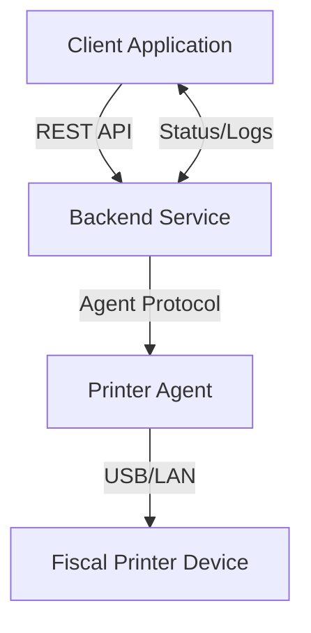

# Fiscal Agent (Virtual Printer)

## Introduction

Fiscal Agent Printer is a backend service designed to manage printing operations for fiscal documents. It streamlines the communication between fiscal agents and connected printers, ensuring secure and reliable printing of invoices, receipts, and other fiscal materials. This repository provides a robust foundation for fiscal document printing workflows, supporting extensibility and integration with various hardware agents. It is implemented in Kotlin and uses Jetpack Compose for the UI layer.

## Features

- RESTful API for printer management and fiscal print tasks
- Support for multiple printer agents and device types
- Job queuing and status tracking
- Secure authentication and request validation
- Configurable server and agent settings
- Comprehensive logging for audit and debugging
- Extensible architecture for additional device support

## Requirements

- Kotlin 1.8 or higher
- Gradle for dependency management and builds
- Android Studio or IntelliJ IDEA for development
- Jetpack Compose runtime for UI components
- Supported fiscal printer drivers (see configuration)
- Network connectivity for agent-printer communication
- (Optional) Docker for containerized deployment

## Installation

To set up Fiscal Agent Printer, follow these steps:

1. Clone the repository:
   ```bash
   git clone https://github.com/herdiantristyantono/fiscal-agent-printer.git
   cd fiscal-agent-printer
   ```

2. Build the project and download dependencies:
   ```bash
   ./gradlew build
   ```

3. Configure environment variables (see Configuration section).

4. Run the application:
   ```bash
   ./gradlew run
   # or for Android:
   ./gradlew installDebug
   ```

## Usage

Fiscal Agent Printer exposes RESTful endpoints to manage printers and print fiscal documents. Integrate with your fiscal processing application or ERP by sending HTTP requests to the API.

- Register and manage fiscal printer agents.
- Submit print jobs with document details.
- Query job status and retrieve logs.

### Example Usage Flow

1. Register a new printer agent with the service.
2. Submit a print job specifying the document type and agent.
3. Monitor the job status until completion.
4. Retrieve printing results or error logs as needed.

### Architecture Overview



## API Documentation

### Register a New Printer Agent

#### POST /api/agents

```api
{
    "title": "Register Printer Agent",
    "description": "Register a new fiscal printer agent with device details.",
    "method": "POST",
    "baseUrl": "https://your-domain.com",
    "endpoint": "/api/agents",
    "headers": [
        {
            "key": "Authorization",
            "value": "Bearer <token>",
            "required": true
        },
        {
            "key": "Content-Type",
            "value": "application/json",
            "required": true
        }
    ],
    "bodyType": "json",
    "requestBody": "{\n  \"name\": \"Agent Name\",\n  \"type\": \"printer_type\",\n  \"connection\": \"USB|LAN|COM\",\n  \"address\": \"192.168.1.100\"\n}",
    "responses": {
        "201": {
            "description": "Agent registered successfully",
            "body": "{\n  \"id\": \"agent_id\",\n  \"status\": \"active\"\n}"
        },
        "400": {
            "description": "Validation error",
            "body": "{\n  \"error\": \"Missing required parameters\"\n}"
        }
    }
}
```

### Submit a Print Job

#### POST /api/jobs

```api
{
    "title": "Submit Print Job",
    "description": "Submit a fiscal print job to a registered agent.",
    "method": "POST",
    "baseUrl": "https://your-domain.com",
    "endpoint": "/api/jobs",
    "headers": [
        {
            "key": "Authorization",
            "value": "Bearer <token>",
            "required": true
        },
        {
            "key": "Content-Type",
            "value": "application/json",
            "required": true
        }
    ],
    "bodyType": "json",
    "requestBody": "{\n  \"agentId\": \"agent_id\",\n  \"document\": {\n    \"type\": \"invoice\",\n    \"data\": {\n      ...\n    }\n  }\n}",
    "responses": {
        "202": {
            "description": "Print job accepted",
            "body": "{\n  \"jobId\": \"job_id\",\n  \"status\": \"queued\"\n}"
        },
        "404": {
            "description": "Agent not found",
            "body": "{\n  \"error\": \"Invalid agent ID\"\n}"
        }
    }
}
```

### Get Print Job Status

#### GET /api/jobs/:id

```api
{
    "title": "Get Print Job Status",
    "description": "Retrieve the status and result of a submitted print job.",
    "method": "GET",
    "baseUrl": "https://your-domain.com",
    "endpoint": "/api/jobs/:id",
    "headers": [
        {
            "key": "Authorization",
            "value": "Bearer <token>",
            "required": true
        }
    ],
    "pathParams": [
        {
            "key": "id",
            "value": "Job ID",
            "required": true
        }
    ],
    "bodyType": "none",
    "responses": {
        "200": {
            "description": "Job status retrieved",
            "body": "{\n  \"jobId\": \"job_id\",\n  \"status\": \"completed|failed|queued|in_progress\",\n  \"result\": {...}\n}"
        },
        "404": {
            "description": "Job not found",
            "body": "{\n  \"error\": \"Job ID does not exist\"\n}"
        }
    }
}
```

### List Registered Agents

#### GET /api/agents

```api
{
    "title": "List Printer Agents",
    "description": "Retrieve a list of all registered printer agents.",
    "method": "GET",
    "baseUrl": "https://your-domain.com",
    "endpoint": "/api/agents",
    "headers": [
        {
            "key": "Authorization",
            "value": "Bearer <token>",
            "required": true
        }
    ],
    "bodyType": "none",
    "responses": {
        "200": {
            "description": "List of agents",
            "body": "[\n  {\n    \"id\": \"agent_id\",\n    \"name\": \"Agent Name\",\n    \"type\": \"printer_type\",\n    \"status\": \"active\"\n  }\n]"
        }
    }
}
```

## Contributing

Contributions are welcome! To contribute:

- Fork the repository and create your feature branch.
- Commit your changes with clear messages.
- Open a pull request describing your changes.
- Ensure your code passes existing tests and add new ones as appropriate.
- Participate in code reviews and discussions.

Please adhere to the project's code style and guidelines.

## Configuration

Fiscal Agent Printer uses environment variables for configuration. Common settings include:

- `PORT`: Server port
- `DB_CONNECTION`: Database connection string for job and agent storage
- `AGENT_DRIVERS_PATH`: Path to custom fiscal printer drivers
- `LOG_LEVEL`: Logging verbosity (info, debug, warn, error)
- `AUTH_SECRET`: Secret key for authentication tokens

Create a `.env` file in the project root to override defaults:

```env
PORT=3000
DB_CONNECTION=mongodb://localhost:27017/fiscal
AGENT_DRIVERS_PATH=./drivers
LOG_LEVEL=info
AUTH_SECRET=your-secret-key
```

For more advanced agent or device configuration, refer to the documentation in the `config` directory or comments in the sample config files.

---

If you encounter issues, please open an issue on the repository with details and steps to reproduce.